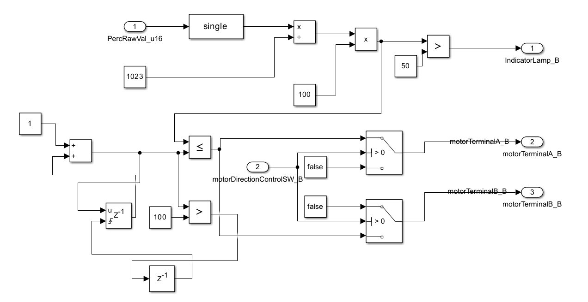

# Speed-Control-of-DC-Motor
Speed Control of a DC Motor using Arduino Uno (PWM)

# Percent Controlled Motor Speed (PCMS) - Software Requirements

**Author:** Sandeep Reddy Modugu 
**Version:** 1  
**Date:** 

---

## Overview

The Percent Controlled Motor Speed (PCMS) software is designed to control motor speed based on input parameters. It processes raw percent values and direction control signals to manage output states for indicator lamps and motor logic.

---

## Inputs

1. **Percent Raw Value (SRS_001)**  
   - **Type:** Integer  
   - **Description:** PCMS shall receive the percent raw value as an integer.

2. **Direction Control Switch (SRS_002)**  
   - **Type:** Boolean  
   - **Description:** PCMS shall receive the direction control switch state as a Boolean value.

---

## Outputs

1. **Indicator Lamp (SRS_003)**  
   - **Type:** Boolean  
   - **Description:** PCMS shall output the indicator lamp state.

2. **Motor Logic A (SRS_003)**  
   - **Type:** Boolean  
   - **Description:** PCMS shall output the state for Motor Logic A.

3. **Motor Logic B (SRS_004)**  
   - **Type:** Boolean  
   - **Description:** PCMS shall output the state for Motor Logic B.

---

## Functional Requirements

1. **Calculate Percent Value (SRS_005)**  
   - **Description:** PCMS shall calculate the percent value as follows:  
     \[
     \text{Percent Value} = \frac{\text{SRS_001 (Percent Raw Value)}}{\text{Calibratable Value (ADC Resolution)}}
     \]

2. **Indicator Lamp Logic (SRS_006)**  
   - **Description:**  
     - PCMS shall set the `Indicator Lamp` (SRS_003) to **High** when the `Percent Value` is greater than 50%.  
     - Otherwise, the `Indicator Lamp` shall be set to **Low**.

3. **Motor Logic A Control (SRS_007)**  
   - **Description:**  
     - PCMS shall set `Motor Logic A` (SRS_003) to **High** for debouncing execution cycles equal to the `Percent Value` when:  
       - The `Direction Control Switch` (SRS_002) is **inactive**  
       - Execution cycles are less than or equal to the `Percent Value`.  
     - Otherwise, PCMS shall set `Motor Logic A` to **Low**.

4. **Motor Logic A OFF Condition (SRS_008)**  
   - **Description:**  
     - PCMS shall set `Motor Logic A` to **Low** when the `Direction Control Switch` (SRS_002) is **inactive**.

5. **Motor Logic B Control (SRS_009)**  
   - **Description:**  
     - PCMS shall set `Motor Logic B` (SRS_004) to **High** for debouncing execution cycles equal to the `Percent Value` when:  
       - The `Direction Control Switch` (SRS_002) is **active**  
       - Execution cycles are less than or equal to the `Percent Value`.  
     - Otherwise, PCMS shall set `Motor Logic B` to **Low**.

6. **Motor Logic B OFF Condition (SRS_010)**  
   - **Description:**  
     - PCMS shall set `Motor Logic B` to **Low** when the `Direction Control Switch` (SRS_002) is **active**.

---

## Conclusion

This document outlines the software requirements for the Percent Controlled Motor Speed (PCMS) system. The software handles input from raw percent values and direction control, processes the data, and controls motor logic and indicator lamps accordingly.

For any questions or further information, please contact the author.

